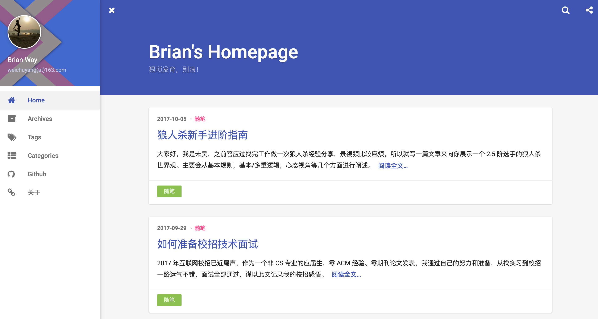

# Brian's Homepage


## Introduction

This is my personal website, You can see the site by clicking [Here](https://brianway.github.io/)

Runing on Github + [Hexo](https://hexo.io/zh-cn/), theme by [indigo](https://github.com/yscoder/hexo-theme-indigo)


这是我的个人网站，基于[Hexo](https://hexo.io/zh-cn/)，主题采用的是[indigo](https://github.com/yscoder/hexo-theme-indigo)

我的个人网站地址: [Brian's Homepage](https://brianway.github.io/)


## Sample





## Important Update

| Time        | update |  
| :--------:  | :----- |
| 2019.04.04  | migrate from Jekyll to Hexo with theme indigo |
| 2017.05.04  | add copyright statement in post template      |
| 2017.04.25  | add reward pictures and copyright statement   |
| 2016.05.16  | update the blog theme                         |
| 2016.04.28  | update the blog theme                         |
| 2016.03.30  | post 22 new articles,springmvc series         |
| 2016.03.10  | post 19 new articles,mybatis series           |
| 2016.02.06  | post 9 new articles,java&javaweb series       |
| 2016.02.04  | update jekyll from 2.x to 3.0.2       		  |  
| 2016.01.09  | change theme from kunka to wiki               |
| 2016.01.08  | set up this website,using theme kunka         |  


## Hexo Update

```
Author: brianway <250902678@qq.com>
Date:   Sun Apr 7 19:43:42 2019 +0800

    [update] 把一些链接换成https的，并添加单篇访问量显示

commit 2d124709f8f0a24884f4d643c310f3116883fa2f
Author: brianway <250902678@qq.com>
Date:   Sun Apr 7 01:28:33 2019 +0800

    [update] 添加License和readme

commit de38ef52763cc2c61886a41fbf164a1f46768b29
Author: brianway <250902678@qq.com>
Date:   Sun Apr 7 00:32:40 2019 +0800

    [update] 更新google和百度统计的ejs

commit 691ca18368990bdf8579e3c47c17d63dac3d105d
Author: brianway <250902678@qq.com>
Date:   Tue Apr 2 01:17:09 2019 +0800

    [update] 修改配置文件和图片


```
