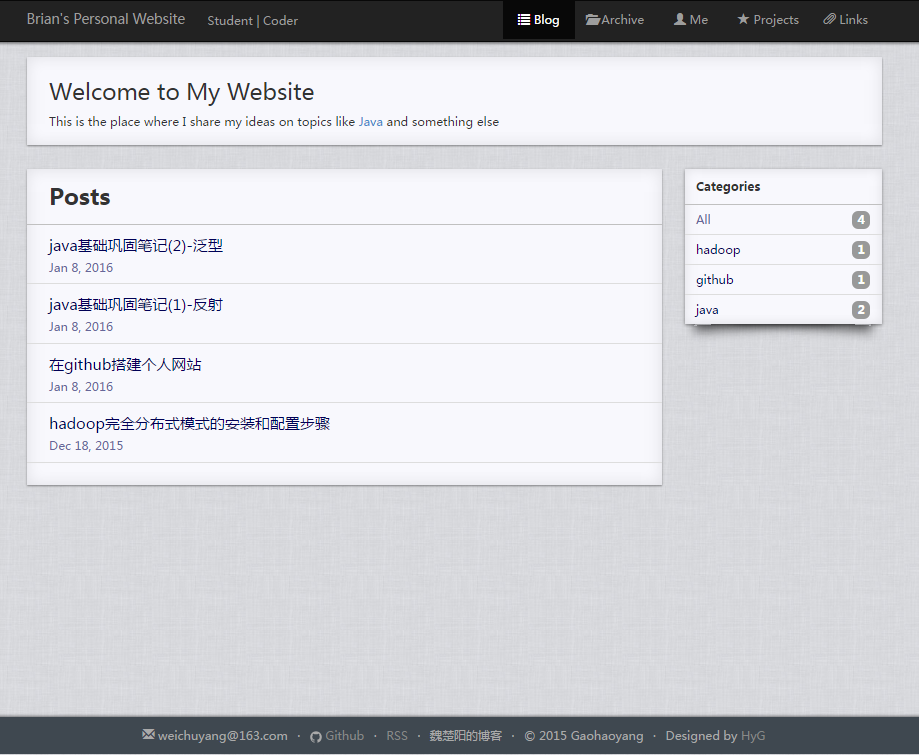

# Brian's Personal Website

---

## Introduction

This is my personal website based on jekyll.**Please give a star at this repository if you think it's nice.** Then you can clone it as your blog model.

You can see the Site by clicking [here](http://brianway.github.io/) 

Runing on Github + Jekyll theme by [Gaohaoyang](https://github.com/Gaohaoyang/gaohaoyang.github.io)

这是我的个人网站，基于jekyll。**如果觉得不错，请先在这个仓库上点个star吧**，这也是对我的肯定和鼓励，谢谢了。

我的个人网站地址: [Brian's Personal Website](http://brianway.github.io/)

该网站使用的是[Gaohaoyang](https://github.com/Gaohaoyang/gaohaoyang.github.io)最新重构的主题

## Sample

## My modification

- create "_data" dir to store my personal infomation,not in the "_config.yml"
- the data in "Links" page also loaded from "_data" dir.
- modify the "Archive" page,make month desplayed
- extract the comment part,reuse the "_include/comments.html" file

## Important Update

| Time        | update |  
| :--------:  | :----- |
| 2016.04.28  | update the blog theme                         |
| 2016.03.30  | post 22 new articles,springmvc series         |
| 2016.03.10  | post 19 new articles,mybatis series           |
| 2016.02.06  | post 9 new articles,java&javaweb series       |
| 2016.02.04  | update jekyll from 2.x to 3.0.2       		  |  
| 2016.01.09  | change theme from kunka to wiki       		  | 
| 2016.01.08  | set up this website,using theme kunka         |  

